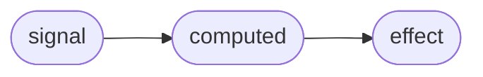

# Async Signals: A Meta-Runtime Kernel for Modern UI Frameworks
A proposal for an async-first, fine-grained reactive runtime.  

**Author:** Luciano  
**Date:** 2025  
**Version:** 1.0  

---

## Abstract
Modern frontend applications increasingly depend on asynchronous data sources:
network requests, streaming APIs, server rendering pipelines, concurrent UI
updates, and distributed client–server state.
Yet today’s dominant reactive models—whether used in Solid, Vue, Qwik, or React
Signals—remain inherently synchronous, propagating updates immediately
through a fine-grained dependency graph.

This mismatch between a synchronous reactivity core and an asynchronous
application architecture creates fundamental problems: stale computations,
out-of-order updates, race conditions, missing cancellation semantics, and
difficulties composing async operations with derived state.

This whitepaper proposes Async Signals, a framework-agnostic runtime kernel
that treats asynchronous state transitions as first-class primitives.
Instead of bolting async tasks onto a synchronous graph, we unify sync +
async propagation under a single scheduler and dependency model.

The outcome is a meta-runtime kernel—similar in spirit to how the Linux kernel
supports many operating systems—capable of powering UI frameworks, server-side
pipelines, and future meta-frameworks.

---

## 1. Introduction
Modern UI development has shifted toward architectures that span multiple
execution environments and timing models:

- server components & partial rendering  
- client-side fine-grained reactivity  
- async data dependencies  
- Suspense-like boundaries  
- concurrent updates  
- distributed state between server, browser, and workers  

Despite these trends, the reactive primitives at the heart of most frameworks
still operate synchronously:


This model works well for synchronous updates but becomes insufficient when:  
- multiple async operations resolve in different orders  
- async boundaries must coordinate with sync updates  
- effects must respond only to the latest resolved value  
- stale promises overwrite newer state  
- cancellation and priority need to be enforced  
- async chains must be committed atomically

This whitepaper argues that async cannot be layered on top of reactivity.
It must be part of the **reactive kernel itself**.

---

## 2. Problem Definition
### 2.1 Sync-first reactivity does not model async semantics
Fine-grained reactivity assumes:

> State updates propagate immediately through the dependency graph.

Async breaks this assumption.

```js
const A = await fetch();
const B = A + 1; // computed
effect(() => render(B));

```

Today’s runtimes struggle with:
- stale propagation: older async results overwrite new ones  
- race conditions: async dependencies resolve unpredictably  
- lack of commit boundaries: partial updates leak into the graph  
- side-effect drift: effects run before async chains complete  
- missing cancellation: no way to discard obsolete tasks  
- scheduling gaps: async tasks bypass batching mechanisms  

Even systems with integrated async abstractions (e.g., Suspense) solve async
rendering at the *framework level*, not at the runtime core.

---

### 2.2 Async tasks require different scheduling semantics
Sync batching relies on microtasks:  

```js
queueMicrotask(flush)
```

But async operations introduce:
- multi-phase lifecycles  
- arbitrary completion timing  
- dependency freezing  
- priority shifts  
- cascading async chains  
- cancellation requirements  

A synchronous scheduler cannot enforce invariants for async transitions.

---

## 3. Async Signals: A New Model
Async Signals introduce four kernel primitives:
```ts
signal()        // sync state
asyncSignal()   // async-producing state
computed()      // derived state
effect()        // side effects
```

But asyncSignal has special semantics:  
- **async propagation**  
  Every async update creates a “future node” in the graph.
- **transactional commit**  
  Async chains commit results in a controlled boundary.
- **stale protection**  
  Older async resolves cannot overwrite new values.
- **cancellable futures**  
  Every async node holds a token for cancellation.
- **scheduler integration**  
  Async jobs enter a unified priority queue.

For example, in a UI or dataflow context:  
```ts
const user = asyncSignal(async () => fetch("/api/user").then(r => r.json()));

const name = computed(() => user()?.name ?? "loading");

effect(() => {
  console.log("User name:", name());
});
```

---

## 4. Meta-Runtime Architecture
A unified runtime pipeline handles all tasks:  

**Key insights**:  
- Async does not live “outside” the graph; it becomes part of it.  
- All resolution paths—sync or async—re-enter the scheduler.  
- The graph maintains consistency through transactional commits.  
- Effects always observe committed, non-stale values.  

For a deeper discussion on how this kernel interacts with server–client
hydration, see **Appendix C: Hydration Pipeline with an Async-First Runtime**.

---

## 5. Algorithmic Semantics
### 5.1 State Resolution Model
Each async signal creates a *resolve cycle*:  
1. Start async task  
2. Freeze current dependencies  
3. On resolution:  
  - check staleness  
  - commit transaction  
  - propagate through graph  

### 5.2 Stale Protection
Each async task is tagged with a monotonically increasing `version`.  
Only the highest version may commit.
```js
if (task.version < current.version) cancel(task)
```
Cancellation semantics may use AbortController or framework-specific mechanisms.
The kernel ensures cancelled tasks never commit their results to the graph.

### 5.3 Transactional Propagation (Informal Semantics)

This runtime treats both synchronous and asynchronous updates as *transactions*:
unit operations that either fully commit a consistent state, or have no visible
effect at all.

Informally, a transaction in this model is:

> a bounded period during which source signals may change and derived nodes are
> recomputed, but **no observer (effects / renderer) sees any intermediate
> state** until the commit point.

We distinguish three phases:

1. **Mutation Phase**  
   - one or more `signal` / `asyncSignal` sources are updated  
   - dependency graph marks affected nodes as dirty  

2. **Compute Phase**  
   - the scheduler recomputes all impacted `computed` nodes  
   - intermediate results are stored in a *staging area* and are not yet visible
     to effects or the UI  

3. **Commit Phase**  
   - once all necessary recomputations are done (or the async task resolves),
     the runtime *atomically* publishes new values  
   - only then are `effect` functions scheduled to run  
   - observers never see partial updates

Key invariants:

- **I1 – No partial visibility**  
  Effects and renderers only observe states that have passed a commit.
- **I2 – All-or-nothing per transaction**  
  For a given transaction, either all derived nodes are updated consistently, or
  none are (e.g. if an async task is cancelled or becomes stale).
- **I3 – Monotonic freshness**  
  When combined with version tags on async tasks, committed states are always
  at least as fresh as any previously visible state.

For synchronous updates, transactions are typically very small and may correspond
to a single batched tick (e.g. one microtask flush).

For asynchronous updates, each `asyncSignal` resolution forms a *logical
transaction*:

- the async task captures a snapshot of its dependencies when it is started  
- on resolution, if its version is still current, the runtime recomputes any
  affected derived nodes and performs a commit  
- if the task has been superseded by a newer version, the entire transaction is
  discarded, and no partial state leaks into the graph

This is similar in spirit to database transactions but scoped to a reactive
graph:

- there is no long-lived locking mechanism  
- isolation is provided by version checks and staged propagation  
- the primary goal is UI consistency, not durability.


---

## 6. Framework Comparison
| Framework         | Fine-Grained | Async Model     | Graph-Level Async | Transaction Semantics | Unified Scheduler |
| ----------------- | ------------ | --------------- | ----------------- | --------------------- | ----------------- |
| React             | No (VDOM)    | Strong          | No                | Partial (RSC)         | Yes (Fiber)       |
| Solid             | Yes          | Limited         | No                | No                    | Sync-first        |
| Vue 3             | Yes-ish      | Limited         | No                | No                    | Batch-only        |
| Qwik              | Yes          | Resumable       | No                | Partial               | Event-driven      |
| TanStack (Query/Router) | N/A    | Strong (data-level) | No            | Partial               | N/A               |
| **This Proposal** | **Yes**      | **First-class** | **Yes**           | **Yes (full)**        | **Yes (unified)** |

Note: “TanStack” here primarily refers to data and routing libraries such as
TanStack Query and TanStack Router, which provide strong async/data semantics
but do not define a UI runtime kernel.

### 6.1 Frameworks Become Renderers When the Kernel Exists
Modern frontend frameworks combine two fundamentally different layers:

1. **Execution Layer (runtime kernel)**  
   - defines how state updates propagate  
   - manages the dependency graph  
   - schedules computation and effects  
   - unifies sync and async semantics  

2. **Rendering Layer (UI framework)**  
   - defines how UI is described (components, JSX, templates)  
   - determines how updates map to DOM/native/canvas  
   - handles hydration, transitions, routing, and developer experience  

Historically, these two layers were tightly coupled inside each framework.
React, Vue, Solid, Qwik, and others each implement their own partial kernel
internally. Because of this coupling, UI semantics and reactivity semantics
cannot be separated.

An async-first signal runtime changes this landscape.

By externalizing the execution layer into an independent kernel:

- frameworks no longer need to implement their own reactive engine  
- frameworks no longer need to manage async ordering or stale protection  
- rendering systems become adapters that connect the kernel to a UI target  
- frameworks can focus solely on component models, DX, and rendering behavior  

In this architecture, frameworks increasingly resemble **renderers**—that is,
modules responsible for mapping committed state to UI—not engines governing the
entire application lifecycle.

This separation mirrors the design of other software ecosystems:

- **Web browsers** contain UI shells, but JavaScript is executed by **V8/JSC**  
- **Desktop environments** (GNOME, KDE) run on top of the **Linux kernel**  
- **Programming languages** (Swift, Rust, Clang) share the **LLVM backend**  

A unified kernel allows frameworks to innovate independently at the UI layer
without reinventing or re-implementing the underlying runtime semantics.

In this model:


The framework becomes an interface between application code and the renderer,
delegating the execution model to the kernel.

This realignment enables a clearer division of responsibility:

- **Kernel**: correctness, async consistency, scheduling, dependency management  
- **Framework**: syntax, rendering, hydration, routing, developer experience  

As a result, introducing an async-first runtime kernel does not compete with
existing frameworks—it **reduces their internal complexity** and **provides a
shared foundation** that many frameworks can adopt or build upon.

#### Architecture Comparison: Traditional Framework vs. Kernel-Based Model

The following diagram contrasts how modern frontend frameworks are internally
structured versus how the architecture changes once the execution model is
delegated to an external async-first kernel.


##### Interpretation
Traditional frameworks embed all major responsibilities inside themselves:  
- state management  
- reactivity graph  
- async behavior & Suspense mechanisms  
- scheduling and batching  
- rendering  
- component model  

This coupling forces each framework to maintain its own partial "kernel," which
limits interoperability and increases complexity.  

In contrast, a **kernel-based architecture** extracts the execution model into
a reusable runtime:  
- fine-grained graph  
- async propagation  
- transactional commits  
- stale protection  
- scheduling  
- effects  

Frameworks become rendering adaptors, responsible only for:  
- component syntax  
- DOM/native rendering  
- hydration & routing  
- developer experience  

This separation mirrors how operating systems, compilers, and browsers isolate
their execution engines from their UI layers.

---

## 7. Why a Kernel, Not a Framework
This proposal intentionally avoids specifying:  
- JSX  
- components  
- rendering  
- templates  
- hydration models  
- routing  
- APIs or DX  

The runtime aims to be a kernel, analogous to:  
- Linux (OS kernel)  
- V8 / JSC (JS engines)  
- LLVM (compiler infrastructure)  

Frameworks may choose their own UI abstractions while sharing a 
common async-first dataflow core.

Unlike OS kernels which provide isolation, a reactive kernel provides a 
shared execution model with guaranteed consistency semantics.

### 7.1 Non-Goals

This proposal does **not** aim to:

- replace existing UI frameworks  
- prescribe a single component model or JSX syntax  
- define a new routing, styling, or rendering abstraction  
- compete with framework-level DX or tooling ecosystems  

The intent is to provide a reusable execution layer that frameworks and
libraries can optionally build upon.

---

## 8. Prototype Implementation
A simplified example:
```ts
const user = asyncSignal(async () => {
  return fetch("/api/user").then(r => r.json());
});

const name = computed(() => user()?.name ?? "loading");

effect(() => {
  console.log("User name:", name());
});

```
Behavioral guarantees:  
- only latest fetch result commits  
- effect runs exactly once per commit  
- intermediate async states never propagate  
- cancellation ensures correctness under concurrency  

---

## 9. Future Directions
- Integration with server-side rendering pipelines  
- Cross-runtime async boundaries (client ⇄ server ⇄ worker)  
- Scheduling priorities for UI transitions  
- Automatic stale propagation prevention  
- Async diffing strategies  
- Compiler hooks for static dependency detection  

---

## 10. Conclusion
Async Signals propose a unified, async-first model for fine-grained reactivity.
By elevating async transitions to kernel-level operations, this approach enables:  
- predictable async behavior  
- safer concurrency  
- framework-agnostic runtime design  
- building new meta-frameworks on top of a shared foundation  

As modern UI architectures continue moving toward hybrid server–client execution,
the lack of a coherent async runtime becomes increasingly limiting.
This proposal aims to open a conversation toward a unified solution.

---

## Appendix A: Terminology
- **Future node** — an async value pending resolution  
- **Version tag** — a monotonically increasing identifier for stale protection  
- **Commit phase** — atomic propagation before effects  
- **Frozen deps** — snapshot of dependencies at async task creation

---

## Appendix B: Limitations
This proposal:  
- does not define a UI framework  
- does not specify render semantics  
- does not affect any existing framework compatibility  
- is purely exploratory  
- welcomes alternative designs and critiques  

---

## Appendix C: Hydration Pipeline with an Async-First Runtime
This appendix describes how an async-first signal runtime can participate in
server–client hydration without prescribing any specific UI framework.

The core idea:

- The **UI tree** is framework-specific (React, Solid, Vue, etc.).  
- The **state & async dataflow** is managed by the Async Signals Runtime.  
- Hydration becomes primarily a **"re-attaching"** process:  
  - the client restores a previously committed graph snapshot,  
  - then resumes async propagation from a consistent baseline.  

### C.1 High-Level Server–Client Flow


Key properties:
- The server commits a transaction before sending HTML.  
- The client runtime starts from an already consistent snapshot.  
- Async tasks resumed on the client go through the same scheduler and
versioning model as on the server.  

### C.2 Runtime-Centric View of Hydration

Notes:
- The graph itself does not need to be fully serialized; in practice,
frameworks may serialize only:  
  - source signal values,  
  - enough metadata to reconstruct dependencies,  
  - version information to protect against stale async updates.  

- Once the client runtime is initialized, no special “hydration mode” is
required in the kernel:  
  - all subsequent updates (sync or async) go through the same pipeline.  
  - the UI framework is responsible for mapping effects to the existing DOM.

### C.3 Hydration and Async Ordering


Hydration amplifies async ordering problems if not handled at the runtime
level. With versioned async signals:  
- Older server-initiated tasks cannot overwrite newer client-initiated ones.  
- The UI always observes a monotonically increasing notion of “freshness”.  
- Hydration is a one-time bootstrap; after that, the async runtime invariants
remain identical to a pure client-side environment.  

### C.4 Division of Responsibilities
- Kernel / Runtime (this proposal):  
  - maintains the dependency graph  
  - manages sync + async scheduling  
  - enforces versioning and stale protection  
  - defines commit phases and transaction semantics  

- UI Framework:  
  - defines components / templates / JSX  
  - maps effects to DOM / virtual DOM / platform primitives  
  - decides how to serialize and restore the view tree  
  - orchestrates when to invoke the runtime during hydration  

By keeping hydration concerns at the UI/rendering layer, and async/state
concerns at the runtime layer, frameworks can experiment with different
hydration strategies while relying on a **consistent**, **async-safe kernel**.

---

## Appendix D: Kernel vs Library vs Framework
This proposal frequently refers to the runtime as a *kernel*, which is
conceptually different from both a *state management library* and a *UI
framework*.

The following diagram illustrates their roles:

```mermaid
flowchart TD
    subgraph Kernel["Runtime Kernel (Execution Model)"]
        K1[Async Signals Runtime<br/>State + Graph + Scheduler + Effects]
    end

    subgraph Frameworks["UI Frameworks / Meta-Frameworks"]
        F1[React]
        F2[Vue]
        F3[Solid]
        F4[Qwik]
        F5[TanStack Start / Other Meta-Frameworks]
    end

    subgraph Libraries["State / Data / Stream Libraries"]
        L1[Redux<br/>(State Container)]
        L2[MobX<br/>(Reactive Store)]
        L3[RxJS<br/>(Stream / Observable)]
        L4[React Query / TanStack Query<br/>(Data Fetching)]
    end

    subgraph Application["Application Code"]
        A1[UI Components]
        A2[Routing / Screens]
        A3[Business Logic]
    end

    Kernel --> Frameworks
    Kernel --> Libraries
    Frameworks --> Application
    Libraries --> Application
```

Interpretation:  
- **Kernel**  
  - defines how state changes propagate  
  - manages dependency graphs & scheduling  
  - integrates sync + async + effects  
  - is framework-agnostic and can power multiple UI systems  
- **Frameworks**  
  - define component models, templates, JSX, routing, hydration  
  - build on top of a kernel (explicitly or implicitly)  
  - expose APIs used directly by applications  
- **Libraries**
  - solve narrower concerns: state storage, data fetching, streams  
  - may internally implement small reactive systems  
  - do not define the global execution model of the UI runtime  

In this sense, an async-first signal runtime aims to behave like a kernel:  
it provides a shared execution substrate on which both frameworks and
libraries can be built, rather than competing with them at the API level.
